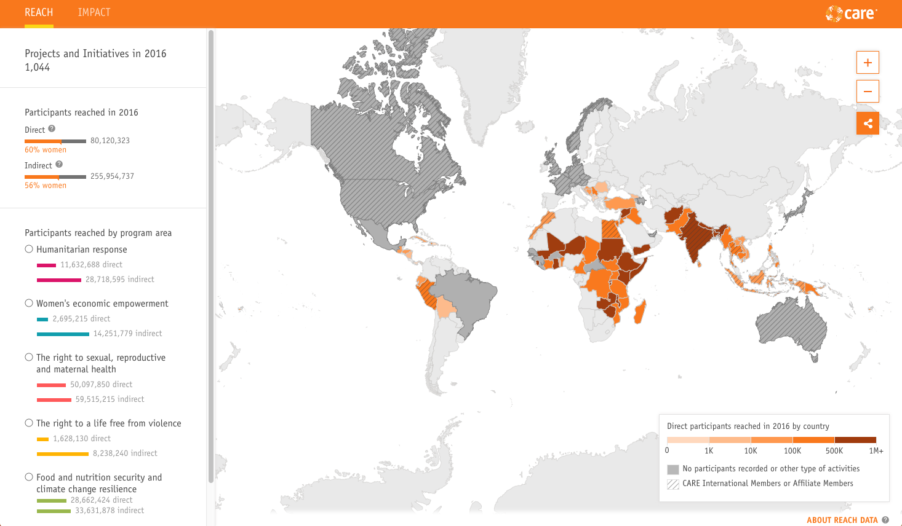

# CARE International



## Installation

Requirements:

* [NodeJs](https://nodejs.org/es/download/)

To install run command:

```bash
yarn install
```

## Usage

In development mode,

create a `.env` file

And run local server running:

```bash
yarn start

```

Build
```bash
yarn build
```
## Deploy to staging
There is a Github pages project set up. 
You simply need to build the project (see above) and run yarn deploy-staging

## Deploy to production
Note this project is hosted in the client's server and we only have FTP access to it. Ask PM for credentials to access it. 

## Contributing

1. Fork it!
2. Create your feature branch: `git checkout -b feature/my-new-feature`
3. Commit your changes: `git commit -am 'Add some feature'`
4. Push to the branch: `git push origin feature/my-new-feature`
5. Submit a pull request :D

## LICENSE

[MIT](LICENSE)
